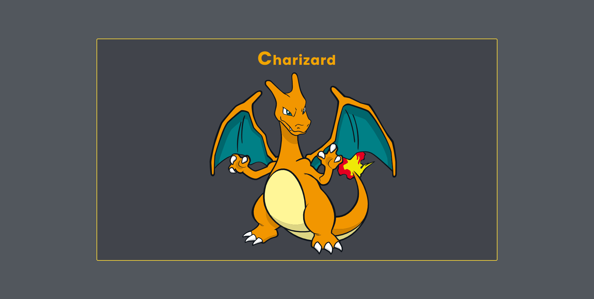

<h1 align="center">Primeiro imagem  do Projeto</h1>



---

# PokeScreen ༼ つ ◕_◕ ༽つ

Projeto criado com finalidade de prática de conceitos 
de responsividade, consumo de API REST.

---
## Techs
- React (create-react-app)
- Styled-Components
- Git && GitHub


---
## Como baixar o projeto.

```bash
# baixar o projeto
$ git clone "URL"
# Instalar dependências
$ yarn || npm install
# Inicializar projeto
$ yarn start || npm start
```
---

##  🥇Conceitos utilizadas para aprendizagem 🥇

- Conceitos de responsividade

- Conceitos de design

- Integração API REST

---
Projeto criado por Luan Nascimento